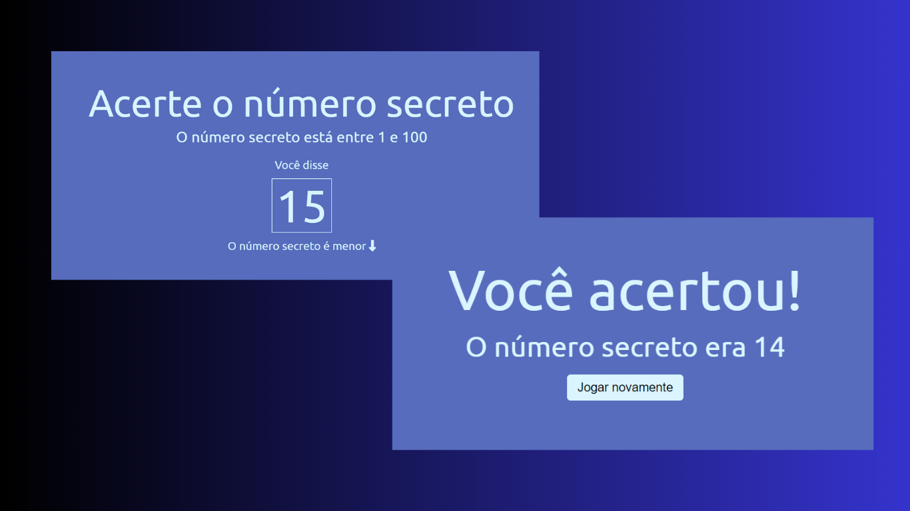

<h1 align="center"> Jogo do Número Secreto</h1>

O programa é um jogo que tem como objetivo adivinhar o número secreto, utilizando comandos de voz para fazer suposições.
 

  <a href="#-tecnologias">Tecnologias</a>&nbsp;&nbsp;&nbsp;|&nbsp;&nbsp;&nbsp;
  <a href="#-projeto">Projeto</a>&nbsp;&nbsp;&nbsp;|&nbsp;&nbsp;&nbsp;
  <a href="#%EF%B8%8F-regras">Regras</a>&nbsp;&nbsp;&nbsp;|&nbsp;&nbsp;&nbsp;
  <a href="#%EF%B8%8F-observação">Observação</a>&nbsp;&nbsp;&nbsp;|&nbsp;&nbsp;&nbsp;
  <a href="#%EF%B8%8F-licença">Licença</a>

  

 

  

## 🚀 Tecnologias

Esse projeto foi desenvolvido com as seguintes tecnologias:

- HTML
- CSS
- JavaScript
- Web Speech API

## 💻 Projeto
Este projeto é um jogo que utilizando comandos de voz para acertar um número secreto que é escolhido pelo sistema,
O programa fornece feedback ao jogador, informando se o palpite está alto, baixo ou correto em relação ao número secreto.

## ✔️ Regras

- Ter um microfone para o reconhecimento da API
- Tentar adivinhar um número de 1 a 100
- Caso o usuário chutar um valor inválido, o erro irá aparecer na tela

## ⚠️ Observação

No momento que o projeto foi criado, a API utilizada (Web Speech API) apresentava uma limitação ao reconhecer algumos números,
eles eram reconhecidos strings (textos). Esperamos que logo a API seja evoluída para conseguir os objetivos do projeto completamente.

## 🔗 Acceso

https://jogo-nro-secreto.vercel.app

## 🗝️ Licença

Esse projeto está sob a licença MIT.

---

Feito com ♥ 
